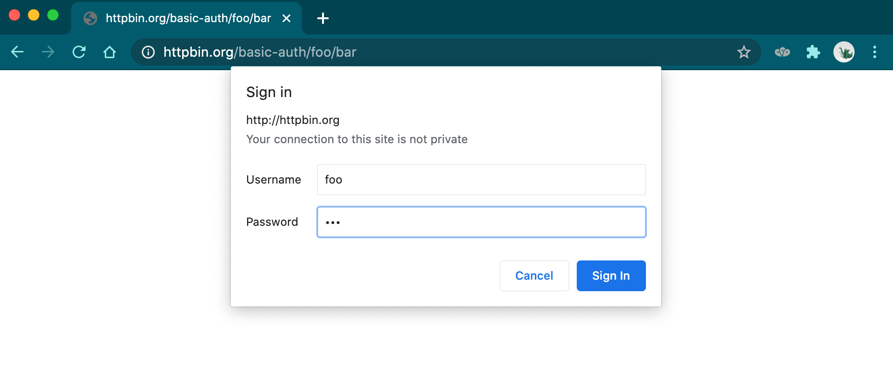

# HTTP Authentification BruteForce

## Description

Thanks to this python script you can bruteforce basics HTTP authentication form.
</br> Here's what an HTTP authentication form looks like:



## Getting Started

To start the program you can use:
```
python main.py
```
You can find a helper using:
```
python main.py -h
```

Have fun! :)